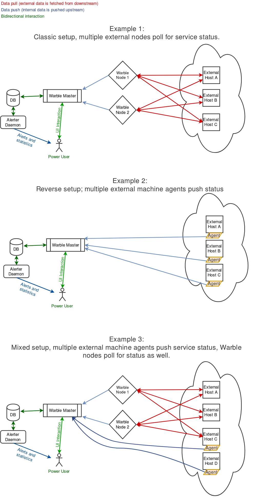
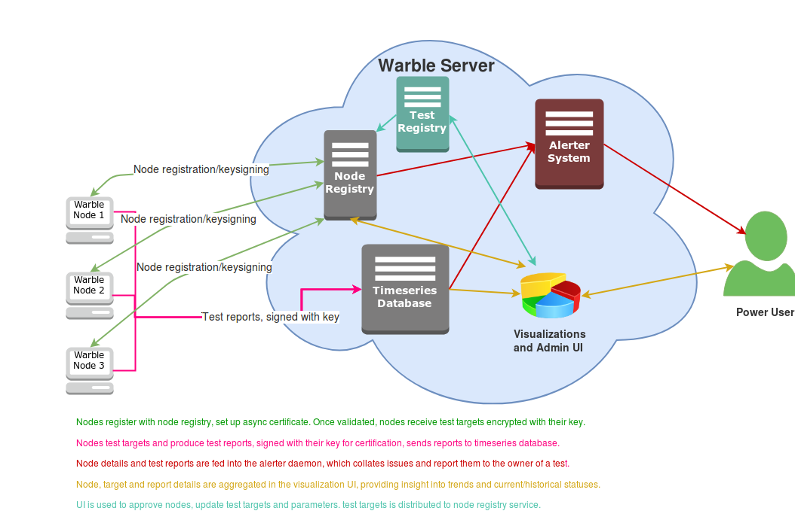
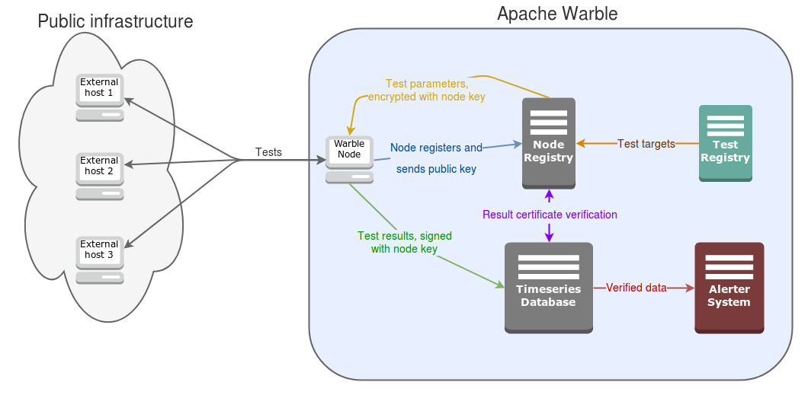

General Design Principles
=========================

.. toctree::
   :maxdepth: 2
   :caption: Contents:

****************************
Client/Server breakdown
****************************

(Work in progress!)
This section shows the basic three applications of Warble.

***********************************
Agent/Node and Server data flows
***********************************

(Work in progress!)
This section shows the various components inside the Warble
Server and how they interact. More to come :)

***********************************
Client and Server communication
***********************************

Agents and Nodes (referred to in this segment as `clients`) communicate
with the Warble Server using a three-stage protocol:

1. First time a client is started, it generates an async RSA key pair
   (default key size is 4096 bits) for encryption and subsequent
   verification/signing. The private key is stored on-disk on the client
   host, and the public key is sent to the node registry on the master,
   along with a request to add the client to the node registry as a
   verified client. The Server registers a unique API key for each
   client, and binds the public key to this API key.

2. Once verified, a client can request test targets and parameters from
   the node registry at the Server. This data is sent back to the client
   in encrypted form, using the previously sent public key. Thus, only
   a verified client can get test targets, and only the client should be
   able to decrypt the payload and get clear-text target data.
 
3. Once a client has completed a test (or a batch of tests), the result
   is sent to the server and signed using the private key. Thus, the
   server can use the public key to verify that the test results came from
   the client.

Once test data has been successfully verified and stored on the server,
both the alerting system and the visualization system can retrieve and
process it, ensuring that what they (and you) see is genuine.

   
   This figure shows the communication channels as outlined in the
   above paragraph.
   

################
Server Component
